<h3><code>fdjri@github ~ $ whoami</code></h3>

<table>
  <tr>
    <td valign="top" align="center"></td>
    <td valign="top" align="center"></td>
  </tr>
</table>

 

<h3><code>fdjri@github ~ $ ./contributions.sh</code></h3>

  

<h3><code>fdjri@github ~ $ ./links.sh</code></h3>

<b>Software Engineer &bull; Full-stack Developer &bull; Mobile Developer</b>

  

## Sholihul Fadjri Triwibowo

I am a Software Engineer focused on building robust, scalable applications and exploring modern technology architectures. 

### Professional Summary
- **Current Focus:** Developing high-performance, full-stack web applications and mobile applications.
- **Interests:** Systems design, mobile apps, backend architecture, and modern frontend frameworks.
- **Contact:** [LinkedIn](https://www.linkedin.com/in/sholihul-fadjri-triwibowo/) &bull; [Email](fadjritwibowo@gmail.com)

---

### Technical Expertise

- **Languages:** TypeScript, JavaScript, Dart, PHP
- **Frontend Frameworks:** Next.js, Laravel, Flutter, Tailwind CSS
- **Backend & APIs:** Node.js, RESTful Architecture
- **Database & Cloud:** MySQL, PostgreSQL, Supabase
- **Tools & Environments:** Git, Vercel, Figma, Postman

---

### Open Source Contributions

  
  

